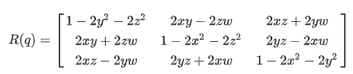
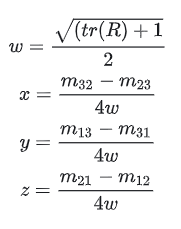

姿态有多种数学表示方式，常见的是四元数，欧拉角，矩阵和轴角。他们各自有其自身的优点，在不同的领域使用不同的表示方式。

参考网址：http://www.crazepony.com/book/wiki/attitude-math.html

# 一、欧拉角

对于在三维空间里的一个参考系，任何坐标系的取向，都可以用三个欧拉角来表现，即($\alpha,\beta,\gamma$)。

## 定义与性质

对于夹角的**顺序**和**标记**，夹角的对应**坐标轴的指定**，并没有任何规定，人们对此并未形成统一。因此每当用到欧拉角时，我们必须明确的表示出夹角的顺序，指定其参考轴。

1. **顺规**：定义了欧拉角的旋转顺序。例如常用的顺规是XYZ，即采用笛卡尔坐标系，三个欧拉角依次表示沿X(roll)、Y(pitch)、Z(yaw)三个轴旋转的角度。

2. **内旋和外旋**：在旋转第二个转角$\beta$时，内旋表示按照旋转后的坐标轴y2旋转，外旋表示按照世界坐标系的坐标轴y0旋转。

性质：**XYZ的内旋等于ZYX的外旋**

## 欧拉角与旋转矩阵的转换

旋转矩阵遵循以下设置：

1. 矩阵以列向量的方式组织

2. 矩阵代表主动变换(active rotation)

3. 旋转顺序为XYZ顺规

4. 旋转方式为内旋

#### 欧拉角 -> 旋转矩阵

可以将欧拉角转化为旋转矩阵$R$：

#### 旋转矩阵 -> 欧拉角

同时根据旋转矩阵$R$，以及对应位置元素$R_{ij}$，可以计算欧拉角：

# 二、四元数

我们可以用单位四元数$q=w+xi+yj+zk$表示旋转

## 四元数与旋转矩阵的转换

#### 四元数 -> 旋转矩阵

#### 旋转矩阵 -> 四元数

# 三、轴角
定义：绕单位轴$u$旋转$\theta$，表示为单位向量$u=(ax,ay,az)$和角度$\theta$的四元组$(ax,ay,az,\theta)$，注意该值与四元数并不相同

## 轴角转化为四元数

$x = ax * sin(\theta/2)$

$y = ay * sin(\theta/2)$

$z = az * sin(\theta/2)$

$w = cos(\theta/2)$

即$(w,v)=(cos(\theta/2), usin(\theta/2))$

## 轴角转化为旋转矩阵

设旋转轴为$$k$$，旋转角度为$\theta$

根据罗德里格斯旋转公式推导获得：

参考：

[1] https://zh.wikipedia.org/wiki/%E6%AC%A7%E6%8B%89%E8%A7%92

[2] https://zhuanlan.zhihu.com/p/85108850

[3] https://zhuanlan.zhihu.com/p/45404840

[4] https://blog.csdn.net/weixin_39675633/article/details/103434557

[5] https://en.wikipedia.org/wiki/Active_and_passive_transformation

[6] https://en.wikipedia.org/wiki/Euler_angles

[7] http://www.crazepony.com/book/wiki/attitude-math.html

[8] https://blog.csdn.net/u014265928/article/details/117161701

[9] https://en.wikipedia.org/wiki/Rodrigues'_rotation_formula